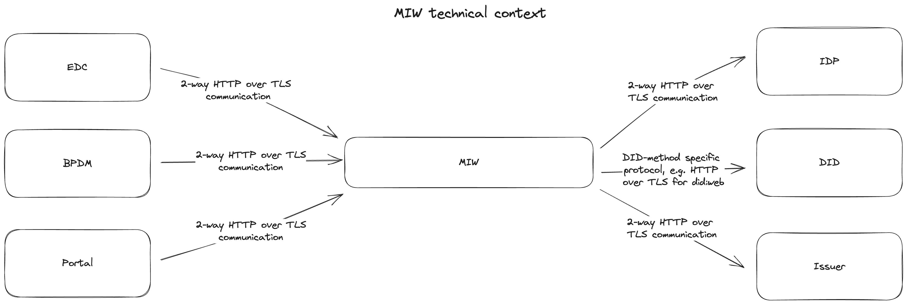

# Table of content

[[toc]]

# Introduction and Goals

To align the identity, authentication and data exchange of participants with
the open and decentralized concepts within
[GAIA-X](https://www.gxfs.eu/specifications/), especially self-sovereign
identities, every legal entity associated to a Business Partner Network (BPN)
number should have the possibility to also get a [W3C compliant Decentralized
Identifier](https://www.w3.org/TR/did-core/) (DID). Due to the lack of
production-ready SSI infrastructure and slow adoption on the market, this is in
a first step achieved by providing a managed wallet with a private/public key
pair and related DID for a legal entity along with the onboarding. This wallet
can then be used via the Managed Identity Wallet API by other services or
applications such as the Self Description Hub or the Eclipse Dataspace
Connectro (EDC) to issue and retrieve [Verifiable
Credentials](https://www.w3.org/TR/vc-data-model/) and create Verifiable
Presentations on behalf of a certain legal entity as part of governance
processes and use cases. In later steps, the same DID and credentials can be
transferred to an external wallet managed by the legal entity itself, allowing
self-sovereign data management and communication. Alternatively, a company can
already bring its own DID upon onboarding and register it as a self-managed
wallet for later interactions with managed wallets for credential and
presentation exchange.

## Requirements Overview

The basic requirements for the Managed Identity Wallet can be summarised as
follows:

- Establish a base DID and associated base wallet as trust anchor for issuing
  operator related Verifiable Credentials

- Link each BPN to a unique DID distinguishing two cases

    - managed: create and register a new DID and managed wallet, and allow the
      owners or administrators of the BPN to access the related wallet and
      credentials via a REST API

    - self-managed: connect an existing DID and external wallet provided by the
      owner or administrator of the BPN in order to issue verifiable
      credentials to and request presentations from the related DID

- Allow other service or user interface components as well as DID owners
  themselves to issue and store Verifiable Credentials

- Allow other service or user interface components as well as DID owners
  themselves to create and validate Verifiable Credentials

- Issue and revoke Verifiable Credentials for consortium related data such as
  the BPN, membership status, business partner data (addresses, bank data etc.)
  according to the onboarding and change processes

- Allow (defined / allow-listed) external issuer wallets to connect to managed
  wallets and issue credentials for the managed wallet DID as the holder

## Quality Goals

   | **Title of Goal** | **Description and Reason**                                                                                                                                                                                                 |
   |-------------------|----------------------------------------------------------------------------------------------------------------------------------------------------------------------------------------------------------------------------|
   | Security          | The Managed Identity Wallet Service must be highly secure in terms of storage and access control, since it handles sensitive private key and claim information.                                                            |
   | Scalability       | The Managed Identity Wallet Service must scale to the expected amount of participants without significant decrease of execution time.                                                                                      |
   | Maintainability   | The Managed Identity Wallet Service should be structured in a modular way and re-use existing (open-source) components, frameworks and libraries where possible, so it can be extended and maintained in an efficient way. |

## Stakeholders

The key stakeholders of the component are:

- Operating Company: to be compliant with SSI concepts, especially for
  Verifiable Presentations in GAIA-X compliant self descriptions

- EDC operators: to be able to use SSI based identity and access management for
  the communication between data consumer and provider

# Architecture Constraints

The architecture of the Managed Identity Wallet Service follows the general
principles, guidelines and boundaries from the [Tractus-X
project](https://projects.eclipse.org/projects/automotive.tractusx). You can
find more details and documentation on the [Tractus-X GitHub
page](https://github.com/eclipse-tractusx).

# System Scope and Context

The Managed Identity Wallet Service is primarily used as a backend
service for service composition or related components like EDC, but can
also directly connect peer-to-peer with other DID agents.

## Business Context


## Technical Context



# Solution Strategy

The Managed Identity Wallet is implemented as an independent REST API
service using the following technology stack:

- Java 17 as a base programming language
- SpringBoot as an encompassing framework
- PostgreSQL as a database backend
- Gradle as a build tool
- Hashicorp Vault for secrets management
- Dockerized setup for Kubernetes with Helm

# Building Block View

## Overall System

The service consists of a main API implementation using SpringBoot and a
PostgreSQL database to persist data 

The Java code is organized by responsibilities, e.g. routers, services,
repositories, etc.

- Routes:
    - DID Document: DID resolution and management
    - Verifiable Credential (VC): issuance and revocation of Verifiable Credentials
    - Verifiable Presentation (VP): issuance and validation of Verifiable Presentations
    - Wallet: create/read/update/delete (CRUD) management of identity wallets
- Services:
    - Business Partner Data Service: Abstraction of calls and response handling
      of BPDM
    - WalletService: General wallet management and orchestration logic

# Runtime View

The currently released API specification and documentation (INT environment)
can be found under
<https://managed-identity-wallets.int.demo.catena-x.net/docs>.

In general, the API covers the following functionality:

- Create, delete and read managed wallets
- Create and update business partner data related credentials
- Manage DID document of the DID of a managed wallet (currently supports only
  creating and updating service endpoints)
- Generate and persist Verifiable Credentials issued by a particular identifier
  of a managed wallet or the base wallet
- Create a Verifiable Presentation for a given list of VCs and presenter (as
  identifier of a managed wallet)
- Validate Verifiable Presentations (convenience functionality, currently only
  supports Indy DIDs as issuers or holders)
- Register self-managed wallets based on an existing DID

In the following, the most relevant operations are described as sequence
diagrams.

### Create Wallet

```plantuml
title Create Wallet

actor User as user

participant PortalIDP as keycloak
participant ManagedIdentityWallet as MIW

box "Get Accesstoken"
  user -> keycloak: Get AccessToken
  keycloak --> user: AccessToken
end box

group "Create Wallet"
    box "Create Wallet"
        user -> MIW: "/api/wallet" with BPN and Name
        group "Wallet Creation"  
            MIW -> MIW: Create Database entry
            MIW -> MIW: Create Private and Public Key
            MIW -> MIW: Store Private Key AES encrypted in DB
            MIW -> MIW: Create DID:web Document
            MIW -> MIW: Store DID-Document
        end group
        group "BPN Credential" 
            MIW -> MIW: Create BPN Credential
            MIW -> MIW: Sign JSON-LD BPN Credential with issuer private key (Private Key of Issuer Wallet)
            MIW -> MIW: Store BPN Credential
        end group
        group "Summary Credential" 
            MIW -> MIW: Access User Wallet
            MIW -> MIW: Check if Summary Credential is already Created
            MIW -> MIW: Check BPN Credential is not already in Summary Credential
            MIW -> MIW: Create Summary Credential with BPN
            MIW -> MIW: Store Summary Credential in Issuer Wallet
            MIW -> MIW: Store Summary Credential in Holder Wallet
        end group
        MIW --> user: Return Wallet
    end box
end group
```

### Issue Membership Credential

```plantuml
title Issue Membership Credential

actor User as User

participant PortalIDP as keycloak
participant ManagedIdentityWallet as MIW

box "Get Accesstoken"
  User -> keycloak: Get AccessToken
  keycloak --> User: AccessToken
end box

group "Issue Membership"
    User -> MIW: "/api/credentials/issuer/membership" with BPN
    group "Create Membership Credential" 
        MIW -> MIW: Create Use Case Credential
        MIW -> MIW: Sign JSON-LD Use Case Credential with issuer private key (Private Key of Issuer Wallet)
        MIW -> MIW: Store Credential in Issuer Wallet
        MIW -> MIW: Store Credential in Holder Wallet
    end group
    group "Summary Credential" 
        MIW -> MIW: Access User Wallet
        MIW -> MIW: Check if Summary Credential is already Created
        MIW -> MIW: Check Membership Credential is not already in Summary Credential
        MIW -> MIW: Delete Summary Credential in User Wallet
        MIW -> MIW: Create Summary Credential with specific Use Case
        MIW -> MIW: Store Summary Credential in Issuer Wallet
        MIW -> MIW: Store Summary Credential in Holder Wallet
    end group
    MIW --> User: Return signed Membership Credential
end group
```

### Issue Usecase Credential

```plantuml
title Issue UseCaseFrameworkCredential

actor User as User

participant PortalIDP as keycloak
participant ManagedIdentityWallet as MIW

box "Get Accesstoken"
  User -> keycloak: Get AccessToken
  keycloak --> User: AccessToken
end box

group "Issue UseCaseCredential"
    User -> MIW: "/api/credentials/issuer/framework" with (BPN, Type, ContractVersion, ContractTemplate)
    group "Use Case Credential" 
        MIW -> MIW: Create Use Case Credential
        MIW -> MIW: Sign JSON-LD Use Case Credential with issuer private key (Private Key of Issuer Wallet)
        MIW -> MIW: Store Credential in Issuer Wallet
    end group
    group "Summary Credential" 
        MIW -> MIW: Access User Wallet
        MIW -> MIW: Check if Summary Credential is already Created
        MIW -> MIW: Check Use Case Credential is not already in Summary Credential
        MIW -> MIW: If not delete Summary Credential in User Wallet
        MIW -> MIW: Create Summary Credential with specific Use Case
        MIW -> MIW: Store Summary Credential in Issuer Wallet
        MIW -> MIW: Store Summary Credential in Holder Wallet
    end group
    MIW --> User: Return signed Use Case Credential
end group
```

### Issue Dismantler Credential

```plantuml
title Issue Dismantler Credential

actor User as User

participant PortalIDP as keycloak
participant ManagedIdentityWallet as MIW

box "Get Accesstoken"
  User -> keycloak: Get AccessToken
  keycloak --> User: AccessToken
end box

group "Issue Dismantler Credential"
    User -> MIW: "/api/credentials/issuer/dismantler" with bpn, activityType, allowedVehicleBrands
    group "Create Dismantler Credential" 
        MIW -> MIW: Create Dismantler Credential
        MIW -> MIW: Sign JSON-LD Dismantler Credential with issuer private key (Private Key of Issuer Wallet)
        MIW -> MIW: Store Credential in Issuer Wallet
        MIW -> MIW: Store Credential in Holder Wallet
    end group
    group "Summary Credential" 
        MIW -> MIW: Access User Wallet
        MIW -> MIW: Check if Summary Credential is already Created
        MIW -> MIW: Check Dismantler Credential is not already in Summary Credential
        MIW -> MIW: Delete Summary Credential in User Wallet
        MIW -> MIW: Create Summary Credential with Dismantler added
        MIW -> MIW: Store Summary Credential in Issuer Wallet
        MIW -> MIW: Store Summary Credential in Holder Wallet
    end group
    MIW --> User: Return signed Dismantler Credential
end group
```

### Fetch Summary Verifiable Presentation 

```plantuml
title Fetch SummaryVP

actor User as User

participant PortalIDP as keycloak
participant ManagedIdentityWallet as MIW

box "Get Accesstoken"
  User -> keycloak: Get AccessToken
  keycloak --> User: AccessToken
end box

group "Get Summary VP"
    group "Get Summary Credential" 
        User -> MIW: "/api/credentials?type=['SummaryCredential']"
        MIW -> MIW: Lookup Credential in Wallet with Type
        MIW --> User: Return Credential(s) with Type
    end group
    group "Create Summary Presentation" 
        User -> MIW: "/api/presentations?withAudience=['Audience1','Audience2']+asJwt=true"
        MIW -> MIW: Issue VP with Audience as JWT
        MIW --> User: Return signed Presentation
    end group
end group
```

### Validate Verifiable Presentation

```plantuml
title Issue Membership Credential

actor User as User

participant PortalIDP as keycloak
participant ManagedIdentityWallet as MIW

box "Get Accesstoken"
  User -> keycloak: Get AccessToken
  keycloak --> User: AccessToken
end box

group "Verify/Validate Verifiable Presentation"
    User -> MIW: "/api/presentations/validation?withDateValidation=true" with VP
    group "Presentation Validation" 
        MIW -> MIW: Check Presentation is not expired
        MIW -> MIW: Validate Presentation JsonLD
        MIW -> MIW: Verify Presentation Signature
    end group
    group "Credential Validation"
        MIW -> MIW: Extract VCs
        MIW -> MIW: Check Credential is not expired
        MIW -> MIW: Validate Credential JsonLD
        MIW -> MIW: Verify Credential Signature
    end group
    MIW --> User: Return Valid or Invalid + Reason
end group
```

### Permission Handling

For the API access, technical users are authenticated based on bearer tokens
(JWT) issued by an external IAM system such as Keycloak. Each API operation
specifies, which scopes/roles are required in order to be allowed to execute
this operations, additionally the BPN associated to a user (expected as a claim
in the JWT) is considered when restricting access to the DID or wallet of the
legal entity the user belongs to. Following are the available scopes:

- `view_wallets`
- `add_wallets`
- `update_wallets`
- `delete_wallets`
- `view_wallet`
- `add_wallet`
- `update_wallet`

#### Example

A decoded JWt access token might look like this:

```json
# header
{
    "alg": "HS256",
    "typ": "JWT"
}
# body
{
    "sub": "1234",
    "name": "Max Musterman",
    "iat": 1516239022,
    "scope": "view_wallets view_wallet",
    "bpn": "BPN00000000XS2X"
}
# signature
{
    ...
}
```
This token would authorize the holder to get a list of wallets or view the
wallet belonging to the BPN.

### Data Model / Schemas

The Managed Identity Wallet service issues a couple of verifiable
credentials with the DID of the base wallet as issuer related to
membership and business partner data. For the credential types and data
model of those verifiable credentials, an own JSON-LD context was
defined in a separate GitHub repository
<https://github.com/catenax-ng/product-core-schemas> and referenced as
raw content in the verifiable credentials context
[https://raw.githubusercontent.com/catenax-ng/product-core-schemas/main/legalEntity](https://raw.githubusercontent.com/catenax-ng/product-core-schemas/main/legalEntityData).
The schema defines the following credential types:

#### BpnCredential

Attestation of the BPNL to a particular DID 

```json
{
    "credentialSubject": {
        "type": ["BpnCredential"],
        "bpn": "BPNL00000000XS2X",
        "id": "did:sov:7rB93fLvW5kgujZ4E57ZxL"
    }
}
```

#### MembershipCredential

Attestation of membership, currently used for Catena-X membership

```json
{
    "credentialSubject": {
        "type": ["MembershipCredential"],
        "memberOf": "Catena-X",
        "status": "Active",
        "startTime": "2022-11-29T10:37:50Z",
        "id": "did:sov:7rB93fLvW5kgujZ4E57ZxL"
    }
}
```

#### NameCredential

Credential representation of a BPDM name element 

```json
{
    "credentialSubject": {
        "data": {
            "value": "Scharr-Tec GmbH & Co KG",
            "nameType": {
                "technicalKey": "LOCAL",
                "name": "The business partner name identifies a business partner in a given context, e.g. a country or region.",
                "url": ""
            },
            "language": {
                "technicalKey": "undefined",
                "name": "Undefined"
            }
        },
        "type": [
            "NameCredential"
        ],
        "id": "did:sov:7rB93fLvW5kgujZ4E57ZxL"
    }
}
```


#### AddressCredential

Credential representation of a BPDM legal address element

```json
{
    "credentialSubject": {
        "data": {
            "version": {
                "characterSet": {
                    "technicalKey": "LATIN",
                    "name": "Latin"
                },
                "language": {
                    "technicalKey": "en",
                    "name": "English"
                }
            },
            "contexts": [],
            "country": {
                "technicalKey": "DE",
                "name": "Germany"
            },
            "administrativeAreas": [],
            "postCodes": [
                {
                    "value": "70565",
                    "postCodeType": {
                        "technicalKey": "OTHER",
                        "name": "Other type",
                        "url": ""
                    }
                }
            ],
            "localities": [
                {
                    "value": "Stuttgart",
                    "localityType": {
                        "technicalKey": "OTHER",
                        "name": "Other",
                        "url": ""
                    },
                    "language": {
                        "technicalKey": "en",
                        "name": "English"
                    }
                }
            ],
            "thoroughfares": [
                {
                    "value": "Liebknechtstr.",
                    "number": "50",
                    "thoroughfareType": {
                        "technicalKey": "OTHER",
                        "name": "Other type",
                        "url": ""
                    },
                    "language": {
                        "technicalKey": "en",
                        "name": "English"
                    }
                }
            ],
            "premises": [],
            "postalDeliveryPoints": [],
            "types": []
        },
        "type": [
            "AddressCredential"
        ],
        "id": "did:sov:7rB93fLvW5kgujZ4E57ZxL"
    }
}

```

#### BankAccountCredential

Credential representation of a BPDM bank account element

```json
{
    "credentialSubject": {
        "data": {
            "internationalBankAccountIdentifier": "DE52500105172967846858",
            "internationalBankIdentifier": "INGDDEFFXXX",
            "currency": {
                "technicalKey": "EUR",
                "name": "Euro"
            }
        },
        "type": [
            "BankAccountCredential"
        ],
        "id": "did:sov:7rB93fLvW5kgujZ4E57ZxL"
    }
}
```

#### LegalFormCredential

Credential representation of the BPDM legal form information

```json
{
    "credentialSubject": {
        "data": {
            "technicalKey": "DE_AG",
            "name": "Aktiengesellschaft",
            "mainAbbreviation": "AG",
            "language": {
                "technicalKey": "de",
                "name": "German"
            },
            "categories": [
                {
                    "name": "AG",
                    "url": ""
                }
            ]
        },
        "type": [
            "LegalFormCredential"
        ],
        "id": "did:sov:7rB93fLvW5kgujZ4E57ZxL"
    }
}
```

# Deployment View

A description of the overall structure of components including how to
run and test it locally as well as on Kubernetes in the cloud is
available in the GitHub repository:
<https://github.com/eclipse-tractusx/managed-identity-wallets>

The following diagram provides an overview of the deployment structure
in Kubernetes (AKS).


# Cross-cutting Concepts

The main driver behind the Managed Identity Wallet Service was the
compliance and compatibility with W3C SSI standards als in relation to
GAIA-X principles. The solution is based on and uses a couple of
standards and re-usable open-source components that can considered of
overarching concern:

- W3C Decentralized Identifiers (DIDs) <https://www.w3.org/TR/did-core/>

- W3C Verifiable Credential Data Model <https://www.w3.org/TR/vc-data-model/>

- W3C Status List 2021 <https://w3c-ccg.github.io/vc-status-list-2021/>

- Linux Foundation Hyperledger Aries (<https://github.com/hyperledger/aries>)
  incorporating the DIF DIDComm messaging standard
  (<https://identity.foundation/didcomm-messaging/spec/>)

- Hyperledger Aries Cloud Agent Python
  (ACA-Py, <https://github.com/hyperledger/aries-cloudagent-python>)

- GAIA-X Federated Services (GXFS) Notarization API Revocation Service
  reference implementation
  (<https://gitlab.com/gaia-x/data-infrastructure-federation-services/not/notarization-service/-/tree/main/services/revocation>)

# Design Decisions

Decisions were made on several aspects as part of the sprint work in
further development of the Managed Identity Wallet Service.

### Selection of DID method

Summary: decision was towards Indy DID (did:sov and future did:indy) due
to the compatibility to the IDUnion network and most available Aries
agent implementations such as the [Business Partner
Agent](https://github.com/hyperledger-labs/business-partner-agent). In
general, the solution should be open to support other DID methods for
resolution and as the holder or presenter of credentials in the future.

(full details see [DID Method Considerations and
Selection](file:////display/CORE/DID+Method+Considerations+and+Selection))

### Usage of ACA-Py versus other framework versus own implementation

Summary: The evaluation revealed that ACA-Py can be used with certain
limitations since it meets the basic requirements. We decided to use it
to save implementation time, and address the limitations within the
ACA-Py community, possibly by contributing extensions or fixes in the
future.

(full details see [ACA-Py local Test and
Evaluation](file:////display/CORE/ACA-Py+local+Test+and+Evaluation))

### Concept and Implementation of Credential Revocation

Summary: Given the standardisation activities in W3C and the already
available implementation from the GXFS Notarization Service, the
recommendation is to use the Status List 2021 approach. For the
implementation, the revocation service in the GXFS Notarization Service
should be re-used if possible, ideally without any source code
dependencies using the published Docker image
(<https://gitlab.com/gaia-x/data-infrastructure-federation-services/not/notarization-service/container_registry/3120998>).

(full details see [MIW Credential
Revocation](file:////display/CORE/MIW+Credential+Revocation))

### Concept and Implementation of Interaction with Self-Managed Wallets

Summary: Since Hyperledger Aries based on DID-Comm seems to evolve into
an industry standard for VC and VP interoperability (e.g. also in GAIA-X
specifications) and there are already working implementations (most
known ACA-Py that we also use in the MIW), it is the preferred option.

(full details see [MIW Interaction with Self-Managed
Wallets](file:////display/CORE/MIW+Interaction+with+Self-Managed+Wallets))

# Quality Requirements

The Managed Identity Wallet sticks to the following Quality Gate
requirements where relevant and applicable:

- Documentation: Architecture

- Documentation: Administrator\'s Guide

- Documentation: Interfaces

- Documentation: Source Code

- Documentation: Development Process

- Documentation: Standardization - Interoperability and Data Sovereignty

- Compliance: GDPR

- Test Results: Deployment/Installation

- Test Results: Code Quality Analysis

- Test Results: System Integration Tests

- Security & Compliance: Penetration Tests

- Security & Compliance: Threat Modeling

- Security & Compliance: Static Application Security Testing

- Security & Compliance: Dynamic Application Security Testing

- Security & Compliance: Secret scanning

- Security & Compliance: Software Composition Analysis

- Security & Compliance: Container Scan

- Security & Compliance: Infrastructure as Code

# Risks and Technical Debts

## Indy DID

Lacking support in Indy SDK and thus ACA-Py, needed to use did:sov for now

The W3C compliant DID method specification for Indy
(https://hyperledger.github.io/indy-did-method/) is still fairly new and not
yet fully implemented in major clients. That is why we had to use the Sovrin
DID
(https://sovrin-foundation.github.io/sovrin/spec/did-method-spec-template.html)
for now, which is not fully W3C compliant and does not contain a network
    identifier to distinguish different ledgers (e.g. testnet and mainnet) in
    the DID.

**Recommendation**

The implementation should be adjusted to did:indy as soon as ACA-Py releases support for this.

## Availability of mainnet

I it envisioned to use the IDUnion mainnet as the Indy ledger for a productive
solution. This mainnet is still under construction and not yet available for
public use, there is also no committed target date, expectations are towards
end of 2022, which would be sufficient for the timeline of Catena-X.

**Recommendation**

Escalate to IDUnion contacts when it becomes clear that the expected date of
general availability can not be met.

## performance

In tests especially with the EDC, response times of the Managed Wallet Service
were rather poor, taking several seconds for operations like create wallet,
credential issuance, creation or validation of presentations.

**Recommendation**

Slow response times need to be analysed and optimised, special load and
performance tests should be conducted for the most relevant use cases and
scenarios.

## Lack of development resources and budget

Open issues from implementation of integration with self-managed wallets

- Interaction with a self-managed wallet must still be configured and tested in
  the cloud setup
- Request presentation from self-managed wallets is not implemented
- Issued verifiable credentials to self-managed wallets do not support
  revocation yet
- The interaction is only possible with the Catena-X wallet (currently, there
  is no requirement to do that for other wallets, though)

**Recommendation**

None

# Glossary

| **Term**                       | **Description**                                                                                                                                                                                                                                                                                      |
|--------------------------------|------------------------------------------------------------------------------------------------------------------------------------------------------------------------------------------------------------------------------------------------------------------------------------------------------|
| JWT                            | A "JWT" (JSON Web Token) is a compact and self-contained token format used for securely transmitting information between parties as a JSON object.                                                                                                                                                   |
| Gaia-X                         | Gaia-X is a European initiative aimed at creating a secure and federated data infrastructure that promotes data sovereignty, interoperability, and transparency, fostering a collaborative and trustworthy ecosystem for data sharing and utilization across various sectors and industries.         |
| Portal                         | The portal is used for the registration/onboarding process of companies and includes the login, user management and the initial registration and verification.                                                                                                                                       |
| Decentralized Identifier (DID) | Decentralized Identifiers are a type of identifiers that are published on decentralized infrastructure making them tamper-proof and highly secure. ([more](https://www.w3.org/TR/did-core/))                                                                                                         |
| Claim                          | A Claim is a statement or piece of information made by an entity, often included in tokens like JWTs or Verifiable Credentials, providing specific details about an individual, object, or attribute, which can be used for authentication, authorization, or verification purposes.                 |
| Verifiable Credential          | A Verifiable Credential is a digitally signed attestation of a specific fact or attribute about an entity, enabling secure and tamper-proof sharing of information.                                                                                                                                  |
| Holder                         | A Holder is an individual or entity that possesses and controls a digital credential or Verifiable Presentation, enabling them to present authenticated information about themselves or their attributes to verifiers in a secure and tamper-proof manner.                                           |
| Issuer                         | An Issuer is an entity or system responsible for creating and issuing digital credentials or Verifiable Credentials, providing authenticated information about individuals, objects, or attributes, which can be reliably presented and verified by others in various applications and contexts.     |
| Verifiable Presentation        | A Verifiable Presentation is a digitally signed collection of Verifiable Credentials that provides a secure and tamper-proof way to present and share authenticated information about an entity's attributes or qualifications.                                                                      |
| Verifier                       | A Verifier is an entity or system responsible for validating and verifying the authenticity and integrity of digital signatures and claims presented in Verifiable Credentials or presentations.                                                                                                     |
| Credential revocation          | Credential revocation refers to the process of invalidating or rendering unusable a previously issued digital credential, often due to changes in the entity's status or security concerns, ensuring that the credential can no longer be relied upon for authentication or authorization.           |
| DIDComm / DID-Comm             | DIDCom (Decentralized Identifier Communication) is a protocol that enables secure and private communication between two parties using decentralized identifiers (DIDs), allowing for direct interaction while maintaining control over personal data and ensuring verifiable authenticity.           |
| Managed Identity Wallet        | A Managed Identity Wallet is a secure digital repository that centrally manages and stores various forms of digital identity information, such as credentials, Verifiable Credentials, and keys, providing convenient access and controlled sharing while ensuring privacy and security.             |
| Self-Managed Identity Wallet   | A Self-Managed Identity Wallet is a personal digital repository that empowers individuals to independently store, control, and share their digital identity information, such as credentials and Verifiable Credentials, offering enhanced privacy and autonomy in managing their own identity data. |

